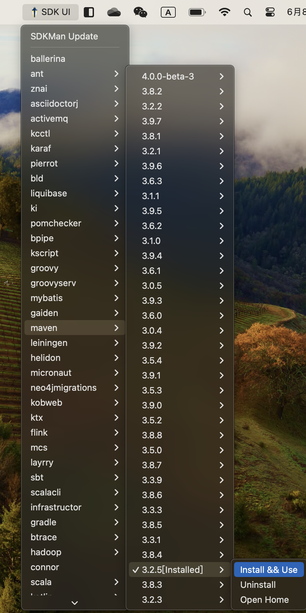

## Introduction  
This project is a system tray application for SDKMan && NVM in Mac OS. 

## Technologies
```GoLang```: 1.22.4  
```SDKMan```: 5.18.2  
```Systray```: 1.2.2  
```NVM```: 0.39.7

## Installation

### Step 1 
Download the Application from Release Page in This Repository  

### Step 2 
Unzip the Application  

### Step 3 
Move the Application to Applications Folder
### Step 4 
Open the Application


## Note
If you can't open the application, the issue may due to the security settings of your Mac. You can follow the steps below to open the application.
### Step 1: Open System Preferences
### Step 2: Click Security & Privacy
### Step 3: Click Open Anyway

## License
This project is licensed under the MIT License - see the LICENSE.md file for details.

## Screenshots
you can select the vendor you need and install/uninstall the `SDKs/Tools` you need.   
for example, you can select the `Java` vendor and click `Install && Use` to the `Java 11.0.23-zulu` version.
If the version has been installed, the `[installed]`will show up after the version. meanwhile, you can open the home folder via this tool.



## Demo  


https://github.com/shanzhengliu/sdkman-ui-go/assets/19382187/7683fe9d-46b6-4238-a4c3-ec6a366b8c01


